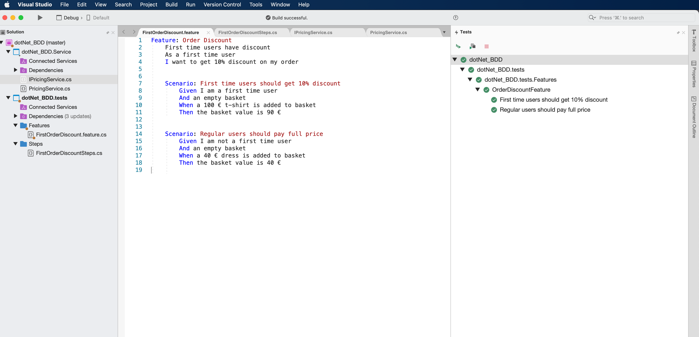

# BDD using SpecFlow

## Discount Order example of a food Service like UberEats

> Scenario : getting a 10 % discount on the first order

> Scenario : paying the full price otherwise

When it's succesfull

When the test fail

